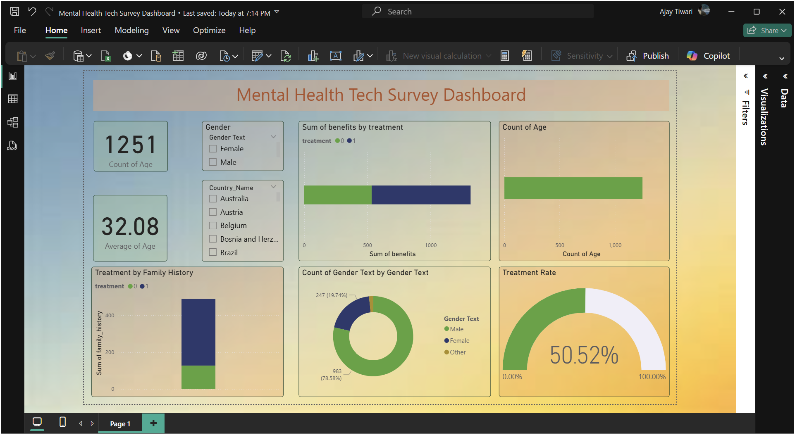

# 🧠 Mental Health in Tech: Predictive Analysis 
This project analyzes the "Mental Health in Tech Survey" dataset from Kaggle to predict whether an employee in the tech industry is likely to seek treatment for a mental health condition. The project involves data cleaning, exploratory data analysis (EDA), feature engineering, and building a predictive model using Python and Scikit-learn. The final insights are visualized in an interactive Power BI dashboard.

## 🎯 Problem Statement
Mental health is a critical issue in the high-pressure tech industry. This project aims to identify the key factors that influence an individual's decision to seek mental health treatment. By building a predictive model, we can better understand the landscape of mental health in the workplace and highlight areas for potential improvement in company policies and support systems.

## 📊 Dataset
The project uses the Mental Health in Tech Survey dataset from Kaggle. This dataset contains over 1,200 responses to a survey about mental health in the tech workplace.

## ⚙️ Project Workflow
1. Data Cleaning & Preprocessing: Handled missing values, corrected inconsistent data (e.g., in 'Age' and 'Gender' columns), and encoded categorical features into a numerical format suitable for machine learning.

2. Exploratory Data Analysis (EDA): Visualized the data using Matplotlib and Seaborn to uncover initial patterns and correlations between different survey responses.

3. Predictive Modeling:

   - Trained a Logistic Regression model to classify whether an individual sought treatment.

   - The model was trained on 80% of the data and evaluated on the remaining 20%.

   - Visualization: Imported the cleaned data into Power BI to create an interactive dashboard showcasing the key findings.

## 📈 Key Results & Findings
- The predictive model achieved an accuracy of 71% on the test set.

- The most significant predictor of seeking treatment was having a family history of mental illness.

- Other important factors included the availability of employer-provided mental health benefits and the willingness of employees to discuss mental health with coworkers.



## 🚀 How to Run This Project
1. **Clone the Repository**
    ````bash

    git clone https://github.com/YourUsername/YourRepositoryName.git

2. **Install the required libraries**
   ````bash

    pip install -r requirements.txt

3. **Run the Python scripts in order, or use the main Jupyter Notebook**

## 🛠️ Tech Stack
Languages: Python

## Libraries: 
Pandas, Scikit-learn, Matplotlib, Seaborn, Kagglehub

## BI Tools:
Power BI

## Author
Ajay Tiwari
B.Tech Final Year-Computer Science (Specialization in Artificial Intelligence).
Passionate about Data Analytics, and Machine Learning.

## Licence
MIT Licence - Feel free to use, modify, and share with attribution.